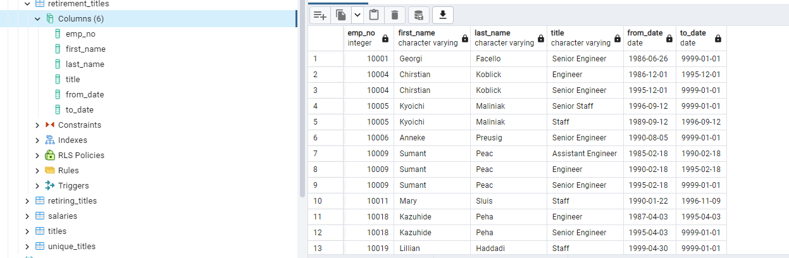
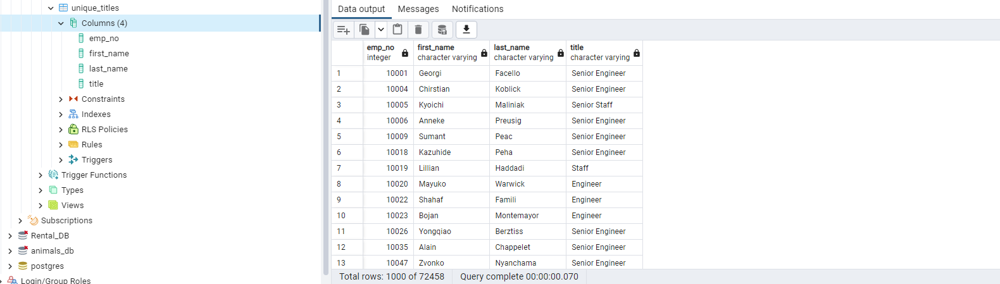
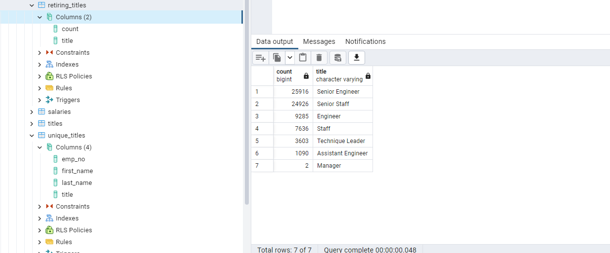

# Pewlett-Hackard-Analysis Challenge Number 7

## Overview of the Analysis

The overview of this analysis was to assist in the creation of a database of Pewlett-Hackard employees who are becoming eligible for retirement.  By using SQL, we were able to take the existing data in the form of Excel CSV's and create tables based on certain criteria.  We were then able to use certain SQL functions to join multiple tables together to create new tables.  The new tables that were created highlighted the demographics not only for just the number of those eligible for retirement, but also their respective titles.  This analysis of the data ultimately allowed for Pewlett-Hackard to prepare for the number of vacant positions as a result of the retiring employees by determining what positions would need to be filled. 

## Results of the Analysis

To first determine the employees who were eligible for retirement, we used the employees table created as a result of importing the corresponding csv of the same title as shown in the code below.  

```
SELECT first_name, last_name
FROM employees
WHERE (birth_date BETWEEN "1952-01-01" AND "1955-12-31")
AND (hire_date BETWEEN "1985-01-01" and "1988-12-31");

```

By importing the data, we were then able to query the names, birth dates and hire dates of only the employees who fit into a certain criterion based upon the determined time frame.  This allowed for Pewlett-Hackard to concern themselves with only those employees.  We were then able to narrow down that data into other tables based upon the retiring employee’s titles which we named retirement_titles, unique_titles and retiring_titles to determine which positions would need to be filled when the employees retire.  Examples of the output created from the creation of the tables can be shown below.







In the final part of the analysis, we used the join, where and order functions as shown in the SQL code below to take the data from three different tables, the employee table, dept_emp and the titles table to create a new table, mentorship_eligibilty which provided insight to employees retiring with certain titles who would be eligible for the mentorship program.  

``` 

SELECT DISTINCT ON (e.emp_no)
e.emp_no,
e.first_name, 
e.last_name,
e.birth_date,
de.from_date,
de.to_date,
t.title
INTO mentorship_eligibilty
FROM employees as e
INNER JOIN dept_emp as de
ON (e.emp_no = de.emp_no)
INNER JOIN titles as t
ON (e.emp_no = t.emp_no)
WHERE (e.birth_date BETWEEN '1965-01-01' AND '1965-12-31')
AND (de.to_date = '9999-01-01')
ORDER BY emp_no;

```

*** 

* Results Based on Retirement and Retiring Titles

Based on the queries described above, our findings indicate that there are only seven types of positions in this case which would need to be filled.  However, that is a small number when compared to the 72,458 titles which would need to be filled as a result of the pending "Silver Tsunami".  The titles of Senior Engineer and Senior Staff have the most employees retiring with 25,916 and 24,926 while there are only two employees that hold the title of Manager who are retiring.  

* Results Based on Unique Titles

By finessing our results from the retirement_titles table to exclude duplication, we determined that while the number of employees is still large, it did not account for the fact that an employee could have held multiple titles while employed at Pewlett-Hackard. As shown in the screenshots below, When we run the unique_titles query, a total of 72,458 results are found compared to the retirement_titles query which had almost twice as much at 133,776.  This indicates that while many have stayed with the company long enough to be eligible for retirement, almost half have already left the company.  


* Results Based on Mentorship Eligibility 

As determined by our explanation of the code for finding mentorship_eligibilty, we used the results from our consolidated data tables to achieve an even smaller dataset.  Based upon our findings, it can be noted that out of 72,458 positions, only 1,549 of them are eligible for the mentorship program.  As with the case of the findings in the retiring titles table, the predominant amount of employees eligible for the program are either Senior Engineers, Senior Staff members, or simply Staff.  It is surprising to note that there are no mangers who are eligible for this program.  

## Summary 

***

* Impact on Roles

  As a result of our findings in the analysis, it can be determined that there are 72,458 titles or positions which will need to be filled.  
  
* Future of Pewlett-Hackard 

* Additional Queries for Analysis 

